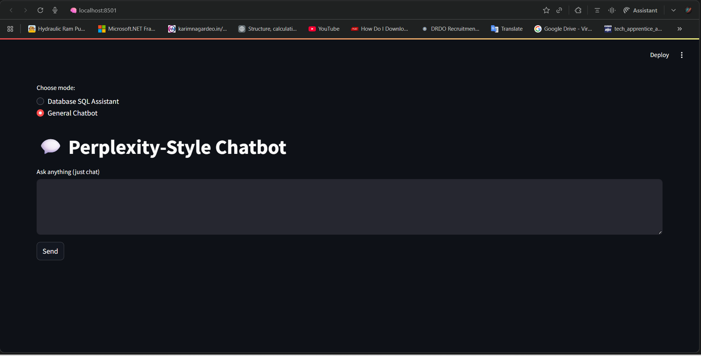
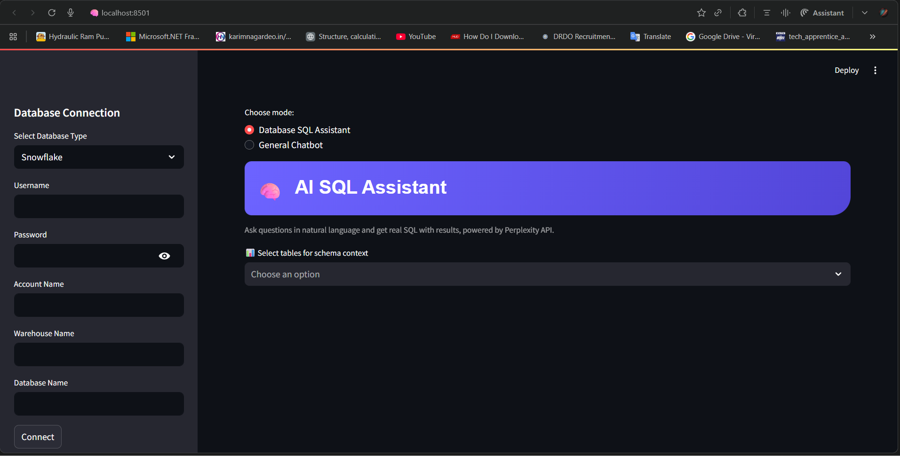
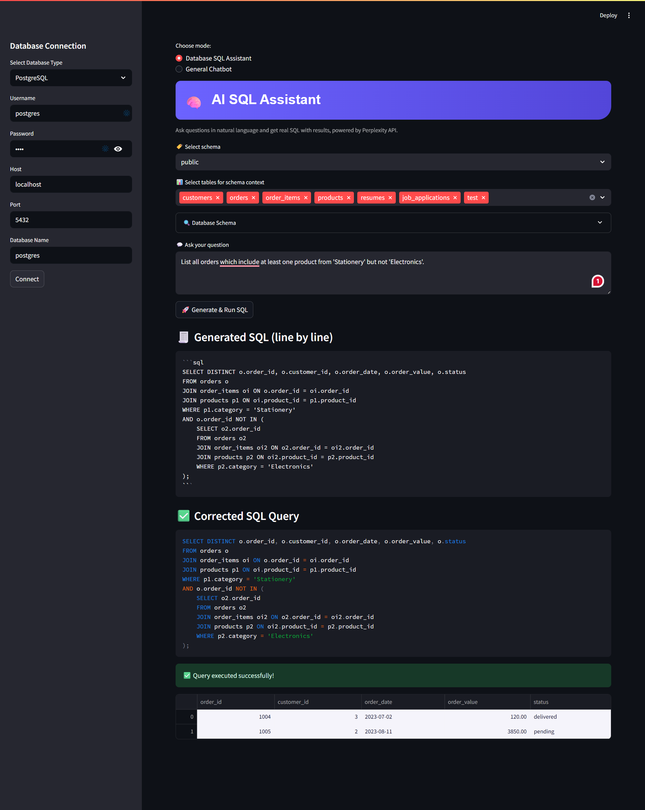

AI SQL Assistant
================

Project Overview
----------------
AI SQL Assistant is a Streamlit-powered app that lets you query databases using plain English and get results instantly, with smart validation, correction, and a Perplexity-powered chatbot mode. Supports major databases including PostgreSQL, MySQL, SQLite, MariaDB, Redshift, Snowflake, DuckDB, SQL Server, and Oracle.

Screenshots
-----------

Features
--------
- Mode selection: Database SQL Assistant / General Chatbot
- One-click connect to major databases
- Automatic schema listing and table context selection
- All tables auto-selected by default for flexible querying
- Natural language questions (e.g., "Orders for Electronics in 2023")
- AI-generated SQL, with validation and correction
- Instant results via Streamlit DataFrame/table
- General-purpose chatbot for non-database Q&A (like Perplexity)
- Clean, modern UI

Usage Instructions
------------------
1. Install requirements:
    pip install -r requirements.txt

2. Get your Perplexity AI API key (see https://www.perplexity.ai/) and set it in your code or as an environment variable.

3. Run the app:
    streamlit run app.py

4. In the app:
    - Select your mode
    - Enter database details, connect
    - Choose schema and table context
    - Type a plain-language question
    - Review the generated SQL and instant results

How the AI Processes User Text
------------------------------
- Tokenizes and splits the text into words/subwords
- Normalizes (lowercase, removes stop words)
- Applies lemmatization and stemming (reduces "orders" to "order")
- Context mapping: matches user input to schema/table/column names
- Perplexity AI interprets intent and generates accurate SQL
- If initial SQL fails, correction logic automatically retries

Script Stages
-------------
1. Mode selection
2. Database connection
3. Schema/table selection
4. Natural language input
5. NLP transformation & prompt handling
6. SQL generation
7. SQL validation/correction
8. Execution and results
9. Error handling
10. General chatbot mode (switchable anytime)

Extending / Customization
-------------------------
- Add more DBs via create_dynamic_engine
- Update the NLP prompt/system instructions for your use-case
- Change UI appearance or add logging/output features

Feedback & Contribution
-----------------------
- This project is an implementation idea, not an official launch.
- For feedback, issues, or contributions, open a GitHub issue or email the author.
- Screenshots, UI suggestions, and feature requests are welcome!

Author: Deeti Pranay Kumar

